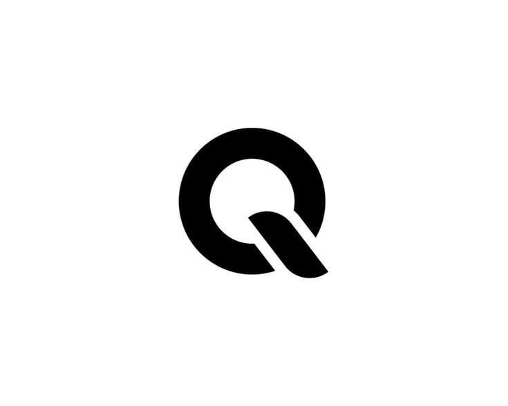

# Qantora - Advanced Trading Platform UI

## 🚀 Overview

Qantora is a cutting-edge trading platform that combines advanced market analysis, AI-powered insights, and comprehensive learning resources. Built with modern web technologies, it provides traders with a sophisticated yet intuitive interface for portfolio management, market analysis, and trading education.

## ✨ Features

### 📊 Portfolio Management
- **Real-time Portfolio Tracking**: Monitor your investments with live updates
- **Market Movers**: Toggle between top gainers and losers with real-time data
- **Trader DNA**: Personalized watchlist of favorite assets
- **Trading Journal**: Document trades with mood tracking, entry/exit prices, and R:R ratios
- **Vision Vault**: Set and track monthly, quarterly, and annual trading goals
- **Performance Analytics**: Detailed insights into your trading performance

### 📈 Markets Analysis
- **Live Market Data**: Real-time price feeds with animated updates
- **Advanced Charting**: Professional-grade charts with multiple timeframes
- **Collapsible Watchlist**: Organized by categories (Stocks, Crypto, Forex, Futures, Indices)
- **Functional Favorites**: Star system for quick asset access
- **Technical Analysis Tools**: Comprehensive set of indicators and drawing tools
- **Responsive Design**: Optimized for both desktop and mobile trading

### 🤖 Cato AI Assistant
- **Mind Mirror Mode**: Specialized trading psychology coaching
- **Chat History**: Persistent conversation tracking
- **Natural Language Processing**: Ask questions about markets and strategies
- **Personalized Insights**: AI-driven analysis based on your trading patterns
- **Real-time Responses**: Fast, contextual trading advice

### 📚 Learning Center
- **Interactive Courses**: Comprehensive trading education programs
- **AI-Generated Content**: Personalized learning materials
- **Expert Articles**: In-depth analysis and educational content
- **Progress Tracking**: Monitor your learning journey
- **Topic Categories**: Organized by trading specialties

### 👥 Community Features
- **Social Trading**: Connect with other traders
- **Trade Rooms**: Live chat rooms for different trading topics
- **Functional Interactions**: Like, comment, and repost system
- **User Profiles**: Detailed trader profiles with statistics
- **Trending Topics**: Real-time discussion trends

## 🛠 Technology Stack

### Frontend
- **Next.js 14**: React framework with App Router
- **TypeScript**: Type-safe development
- **Tailwind CSS**: Utility-first CSS framework
- **Framer Motion**: Advanced animations and interactions
- **Lucide React**: Beautiful icon library
- **Recharts**: Responsive chart library

### UI Components
- **shadcn/ui**: Modern, accessible component library
- **Radix UI**: Unstyled, accessible UI primitives
- **Custom Components**: Specialized trading interface components

### Responsive Design
- **Mobile-First**: Optimized for smaller screens
- **Adaptive Layouts**: Different layouts for mobile and desktop
- **Touch-Friendly**: Mobile-optimized interactions
- **Progressive Enhancement**: Enhanced features for larger screens

## 📱 Mobile Experience

### Optimized Mobile Features
- **Full-Screen Layouts**: Maximized screen real estate
- **Enhanced Navbar**: Larger, more accessible navigation
- **Market Movers**: "See All" feature linking to dedicated page
- **Streamlined UI**: Focused on essential trading functions
- **Touch Interactions**: Optimized for mobile gestures

### Mobile-Specific Pages
- **Market Movers Page**: Dedicated mobile view for top gainers/losers
- **Responsive Charts**: Touch-friendly chart interactions
- **Mobile Navigation**: Optimized tab switching and scrolling

## 📁 Project Structure

\`\`\`
qantora/
├── app/                          # Next.js App Router
│   ├── profile/                  # User profile management
│   ├── settings/                 # Application settings
│   ├── journal/                  # Trading journal
│   ├── vision-vault/             # Goal tracking
│   ├── cato/                     # AI Assistant
│   ├── community/                # Community features
│   │   ├── profile/[username]/   # User profiles
│   │   └── trade-room/[id]/      # Chat rooms
│   ├── learning/                 # Learning Center
│   │   └── article/[id]/         # Article pages
│   ├── markets/                  # Market analysis
│   │   └── movers/               # Mobile market movers
│   ├── globals.css               # Global styles
│   ├── layout.tsx                # Root layout
│   └── page.tsx                  # Homepage (Portfolio)
├── components/                   # Reusable components
│   ├── layout/                   # Layout components
│   ├── markets/                  # Market-specific components
│   └── ui/                       # UI primitives
├── lib/                          # Utility libraries
│   └── utils/                    # Helper functions
├── public/                       # Static assets
├── tailwind.config.ts            # Tailwind configuration
└── README.md                     # Project documentation
\`\`\`

## 🚀 Getting Started

### Prerequisites
- Node.js 18+ 
- npm or yarn package manager

### Installation

1. **Clone the repository**
   \`\`\`bash
   git clone https://github.com/your-username/qantora.git
   cd qantora
   \`\`\`

2. **Install dependencies**
   \`\`\`bash
   npm install
   # or
   yarn install
   \`\`\`

3. **Run the development server**
   \`\`\`bash
   npm run dev
   # or
   yarn dev
   \`\`\`

4. **Open your browser**
   Navigate to [http://localhost:3000](http://localhost:3000)

## 📱 Responsive Design Features

### Desktop Experience
- **Multi-column layouts**: Efficient use of screen space
- **Collapsible sidebars**: Customizable workspace
- **Advanced charting**: Full-featured technical analysis
- **Rich interactions**: Hover states and detailed tooltips

### Mobile Experience
- **Single-column layouts**: Optimized for touch navigation
- **Full-screen charts**: Maximized viewing area
- **Simplified navigation**: Essential features prioritized
- **Touch-optimized**: Swipe gestures and tap interactions

### Tablet Experience
- **Adaptive layouts**: Balanced between mobile and desktop
- **Flexible grids**: Responsive to orientation changes
- **Enhanced touch targets**: Optimized for tablet interaction

## 🎨 Design System

### Color Palette
- **Primary**: Gray scale (#F8FAFC to #111827)
- **Accent**: Blue (#3B82F6), Green (#10B981), Red (#EF4444)
- **Background**: White (#FFFFFF) with subtle grays

### Typography
- **Headings**: Clash Display (Bold, Semibold)
- **Body**: Inter (Regular, Medium, Semibold)
- **UI Elements**: System fonts for optimal performance

### Components
- **Cards**: Rounded corners, subtle shadows
- **Buttons**: Consistent sizing and states
- **Inputs**: Clean borders with focus states
- **Navigation**: Floating design with backdrop blur

## 🔧 Key Features Implementation

### Market Data
- **Real-time Updates**: Simulated live price movements
- **Favorites System**: Persistent user preferences
- **Search Functionality**: Animated search with filtering
- **Category Filtering**: Organized asset browsing

### Trading Journal
- **Automatic Timestamps**: Date and time detection
- **Mood Tracking**: Emotional state recording
- **Trade Details**: Entry/exit prices, R:R ratios
- **Statistics Dashboard**: Performance metrics

### Vision Vault
- **Goal Setting**: Monthly, quarterly, annual targets
- **Progress Tracking**: Visual progress indicators
- **Timeline Management**: Deadline tracking
- **Achievement System**: Milestone celebrations

### AI Integration
- **Contextual Responses**: Trading-specific advice
- **Conversation History**: Persistent chat sessions
- **Mind Mirror Mode**: Psychology-focused coaching
- **Learning Integration**: Educational content generation

## 📊 Performance Optimizations

### Code Splitting
- **Route-based splitting**: Automatic Next.js optimization
- **Component lazy loading**: Improved initial load times
- **Dynamic imports**: On-demand feature loading

### Image Optimization
- **Next.js Image component**: Automatic optimization
- **Responsive images**: Multiple sizes for different screens
- **Lazy loading**: Images load as needed

### Caching Strategies
- **Static generation**: Pre-built pages where possible
- **API caching**: Reduced server requests
- **Browser caching**: Optimized asset delivery

## 🔒 Security Features

### Data Protection
- **Input validation**: Comprehensive sanitization
- **XSS prevention**: Content security policies
- **CSRF protection**: Request validation

### User Privacy
- **Local storage**: Sensitive data kept client-side
- **Secure authentication**: Protected user sessions
- **Data encryption**: Secure data transmission

## 🚀 Deployment

### Vercel (Recommended)
1. Connect GitHub repository to Vercel
2. Configure environment variables
3. Deploy automatically on push to main branch

### Manual Deployment
\`\`\`bash
npm run build
npm run start
\`\`\`

## 🤝 Contributing

We welcome contributions! Please see our [Contributing Guide](CONTRIBUTING.md) for details.

### Development Workflow
1. Fork the repository
2. Create a feature branch
3. Make your changes
4. Add tests if applicable
5. Submit a pull request

## 📄 License

This project is licensed under the MIT License - see the [LICENSE](LICENSE) file for details.

## 🆘 Support

### Documentation
- [API Documentation](docs/api.md)
- [Component Library](docs/components.md)
- [Deployment Guide](docs/deployment.md)

### Community
- [Discord Server](https://discord.gg/qantora)
- [GitHub Discussions](https://github.com/qantora/discussions)
- [Stack Overflow](https://stackoverflow.com/questions/tagged/qantora)

### Contact
- **Email**: support@qantora.com
- **Twitter**: [@QantoraTrading](https://twitter.com/QantoraTrading)
- **LinkedIn**: [Qantora](https://linkedin.com/company/qantora)

---

**Built with ❤️ by the Qantora Team**

*Empowering traders with advanced technology and comprehensive education.*
